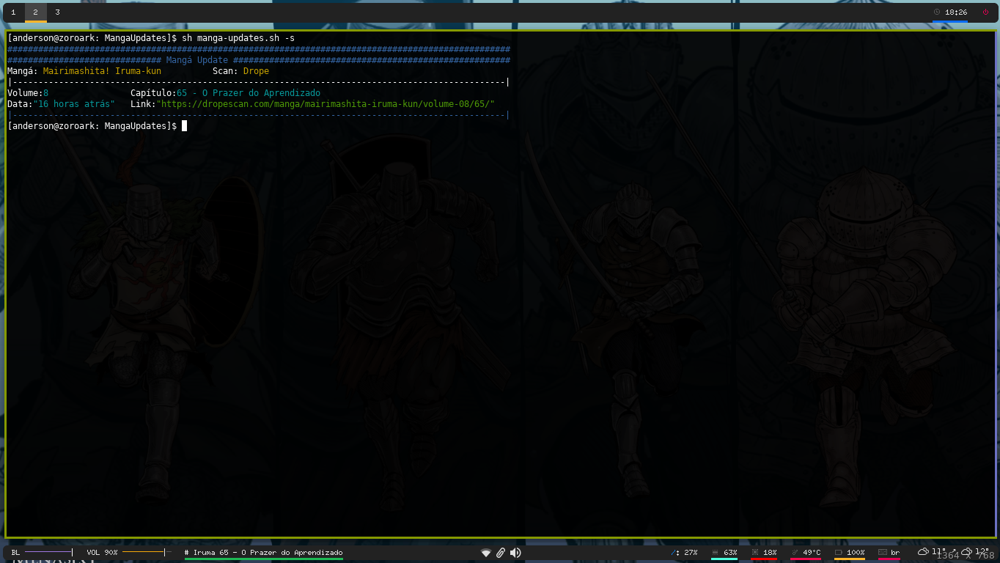

# Disclaimer
Isso é um protótipo de uma idéia de automatização de feeds por meio de web scraping com python, logo não prometo fazer ele funcionar na sua máquina.

Obs.: Estou atualmente usando void-linux, logo todos os pacotes de SO estão baseados nele

### Dependencias:
```sh
sudo xbps-install python3-devel python3-pip libxml2-devel gcc jq
```

Instalando o scrapy
```sh
sudo pip3 install scrapy
```

### Como usar:
Dentro da pasta MangaUpdates dê permissões e execute o shell *manga-updates.sh -s*, o -s irá mostrar as informações na tela, caso use polybar coloque a instrução -p no config do módulo que invoca o script.
```sh
chmod +x manga-updates.sh
sh manga-updates.sh -s
```
Irá mostrar um retorno assim:
```
[anderson@zoroark: MangaUpdates]$ sh manga-updates.sh -s
############################################################################################ Mangá Update######################################################
Mangá: Mairimashita! Iruma-kun		Scan: Drope
|------------------------------------------------------------------------------------------------|
Volume:8 	 Capítulo:65 - O Prazer do Aprendizado 
Data:"16 horas atrás" 	Link:"https://dropescan.com/manga/mairimashita-iruma-kun/volume-08/65/"
|------------------------------------------------------------------------------------------------|
[anderson@zoroark: MangaUpdates]$ 
```
Imagem tanto da saída como do polybar(bar inferior lado esquerdo)


Pastas
```sh
├── MangaUpdates
│   ├── items.py
│   ├── middlewares.py
│   ├── pipelines.py
│   ├── settings.py
│   └── spiders/
├── dependencias.txt
├── iruma.json
├── manga-updates.sh
├── readme.md
└── scrapy.cfg

```

### Polybar
```sh
[module/mangas]
type = custom/script
interval = 1
format-prefix = "# "
format = <label>
exec = /your-local/MangaUpdates/manga-updates.sh -p
format-underline = #1db954
```

Créditos:
[Scrapy](https://scrapy.org/)
[jq](https://stedolan.github.io/jq/manual/#Invokingjq)
[Shellscript.sh](https://www.shellscript.sh/functions.html)
[Shell Scrpt tratamento de funções](http://www.devin.com.br/shell-script-tratamento-de-argumentos-e-opcoes/)
[Stack overflow](https://stackoverflow.com/)